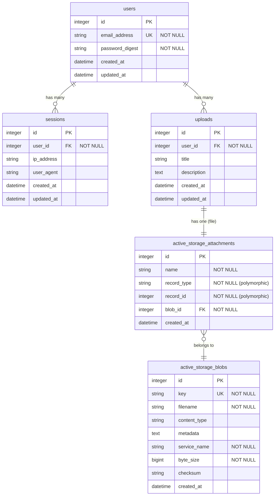

# ER図

- `users`, `sessions`, `uploads` — アプリケーションのテーブル
- `active_storage_blobs`, `active_storage_attachments` — Rails 内部テーブル (Active Storage)

```mermaid
erDiagram
    users {
        integer id PK
        string email_address UK "NOT NULL"
        string password_digest "NOT NULL"
        datetime created_at
        datetime updated_at
    }

    sessions {
        integer id PK
        integer user_id FK "NOT NULL"
        string ip_address
        string user_agent
        datetime created_at
        datetime updated_at
    }

    uploads {
        integer id PK
        integer user_id FK "NOT NULL"
        string title
        text description
        datetime created_at
        datetime updated_at
    }

    active_storage_blobs {
        integer id PK
        string key UK "NOT NULL"
        string filename "NOT NULL"
        string content_type
        text metadata
        string service_name "NOT NULL"
        bigint byte_size "NOT NULL"
        string checksum
        datetime created_at
    }

    active_storage_attachments {
        integer id PK
        string name "NOT NULL"
        string record_type "NOT NULL (polymorphic)"
        integer record_id "NOT NULL (polymorphic)"
        integer blob_id FK "NOT NULL"
        datetime created_at
    }

    users ||--o{ sessions : "has many"
    users ||--o{ uploads : "has many"
    uploads ||--|| active_storage_attachments : "has one (file)"
    active_storage_attachments }o--|| active_storage_blobs : "belongs to"
```
