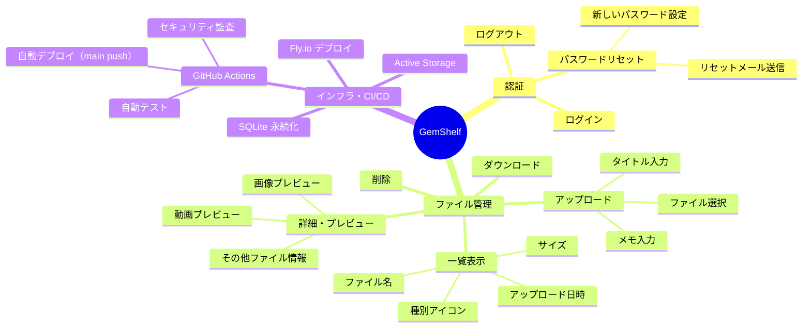

# 機能ツリー

```mermaid
mindmap
  root((GemShelf))
    認証
      ログイン
      ログアウト
      パスワードリセット
        リセットメール送信
        新しいパスワード設定
    ファイル管理
      アップロード
        タイトル入力
        メモ入力
        ファイル選択
      一覧表示
        ファイル名
        種別アイコン
        サイズ
        アップロード日時
      詳細・プレビュー
        画像プレビュー
        動画プレビュー
        その他ファイル情報
      ダウンロード
      削除
    インフラ・CI/CD
      Fly.io デプロイ
      GitHub Actions
        自動テスト
        セキュリティ監査
        自動デプロイ（main push）
      SQLite 永続化
      Active Storage
```
