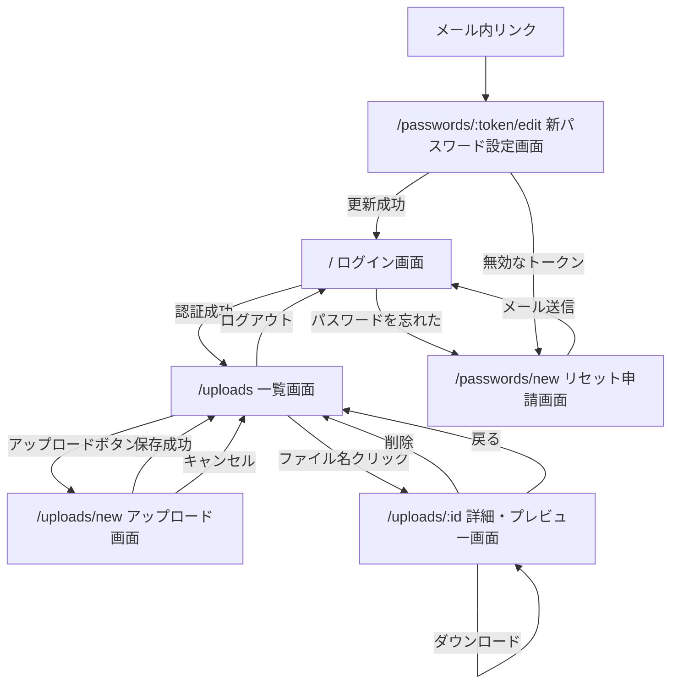

# 画面遷移図

```mermaid
flowchart TD
    A["/ ログイン画面"] -->|認証成功| B["/uploads 一覧画面"]
    A -->|パスワードを忘れた| C["/passwords/new リセット申請画面"]
    C -->|メール送信| A
    D["メール内リンク"] --> E["/passwords/:token/edit 新パスワード設定画面"]
    E -->|更新成功| A
    E -->|無効なトークン| C

    B -->|アップロードボタン| F["/uploads/new アップロード画面"]
    F -->|保存成功| B
    F -->|キャンセル| B
    B -->|ファイル名クリック| G["/uploads/:id 詳細・プレビュー画面"]
    G -->|ダウンロード| G
    G -->|削除| B
    G -->|戻る| B

    B -->|ログアウト| A
```
