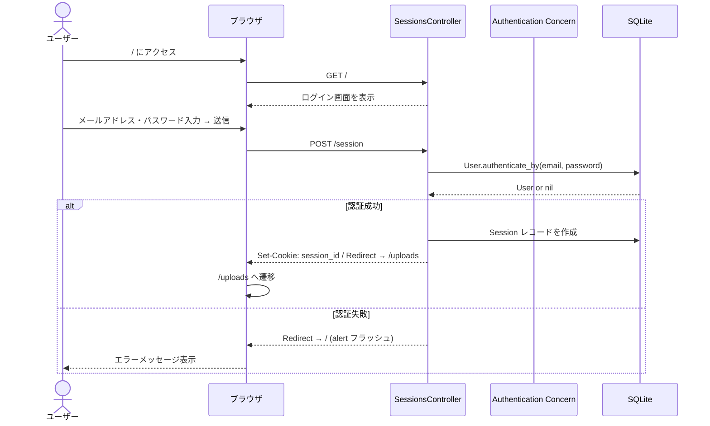
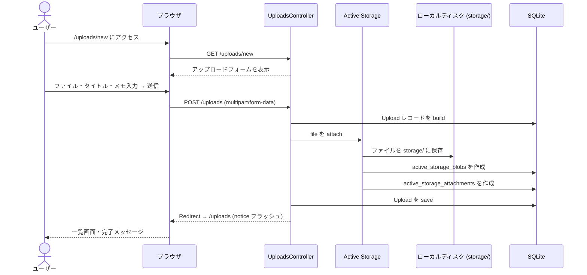
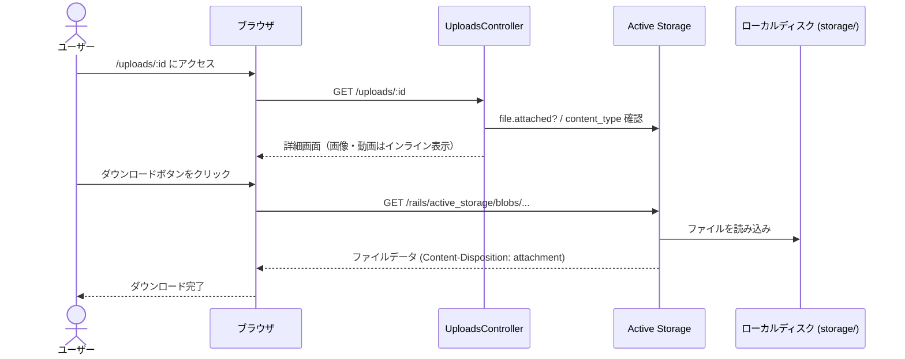
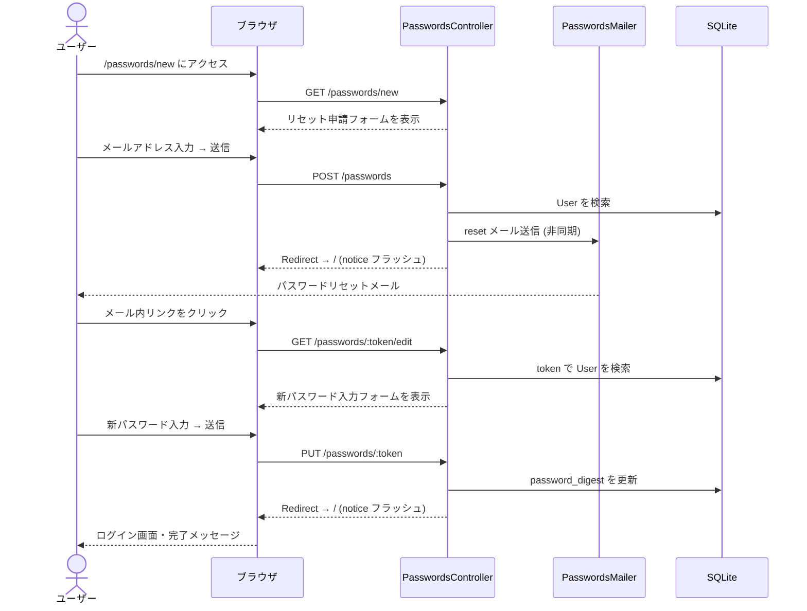

# シーケンス図

## ログイン

```mermaid
sequenceDiagram
    actor User as ユーザー
    participant Browser as ブラウザ
    participant Sessions as SessionsController
    participant Auth as Authentication Concern
    participant DB as SQLite

    User->>Browser: / にアクセス
    Browser->>Sessions: GET /
    Sessions-->>Browser: ログイン画面を表示

    User->>Browser: メールアドレス・パスワード入力 → 送信
    Browser->>Sessions: POST /session
    Sessions->>DB: User.authenticate_by(email, password)
    DB-->>Sessions: User or nil

    alt 認証成功
        Sessions->>DB: Session レコードを作成
        Sessions-->>Browser: Set-Cookie: session_id / Redirect → /uploads
        Browser->>Browser: /uploads へ遷移
    else 認証失敗
        Sessions-->>Browser: Redirect → / (alert フラッシュ)
        Browser-->>User: エラーメッセージ表示
    end
```

## ファイルアップロード

```mermaid
sequenceDiagram
    actor User as ユーザー
    participant Browser as ブラウザ
    participant Uploads as UploadsController
    participant AS as Active Storage
    participant Disk as ローカルディスク (storage/)
    participant DB as SQLite

    User->>Browser: /uploads/new にアクセス
    Browser->>Uploads: GET /uploads/new
    Uploads-->>Browser: アップロードフォームを表示

    User->>Browser: ファイル・タイトル・メモ入力 → 送信
    Browser->>Uploads: POST /uploads (multipart/form-data)
    Uploads->>DB: Upload レコードを build
    Uploads->>AS: file を attach
    AS->>Disk: ファイルを storage/ に保存
    AS->>DB: active_storage_blobs を作成
    AS->>DB: active_storage_attachments を作成
    Uploads->>DB: Upload を save
    Uploads-->>Browser: Redirect → /uploads (notice フラッシュ)
    Browser-->>User: 一覧画面・完了メッセージ
```

## ファイルダウンロード / プレビュー

```mermaid
sequenceDiagram
    actor User as ユーザー
    participant Browser as ブラウザ
    participant Uploads as UploadsController
    participant AS as Active Storage
    participant Disk as ローカルディスク (storage/)

    User->>Browser: /uploads/:id にアクセス
    Browser->>Uploads: GET /uploads/:id
    Uploads->>AS: file.attached? / content_type 確認
    Uploads-->>Browser: 詳細画面（画像・動画はインライン表示）

    User->>Browser: ダウンロードボタンをクリック
    Browser->>AS: GET /rails/active_storage/blobs/...
    AS->>Disk: ファイルを読み込み
    AS-->>Browser: ファイルデータ (Content-Disposition: attachment)
    Browser-->>User: ダウンロード完了
```

## パスワードリセット

```mermaid
sequenceDiagram
    actor User as ユーザー
    participant Browser as ブラウザ
    participant Passwords as PasswordsController
    participant Mailer as PasswordsMailer
    participant DB as SQLite

    User->>Browser: /passwords/new にアクセス
    Browser->>Passwords: GET /passwords/new
    Passwords-->>Browser: リセット申請フォームを表示

    User->>Browser: メールアドレス入力 → 送信
    Browser->>Passwords: POST /passwords
    Passwords->>DB: User を検索
    Passwords->>Mailer: reset メール送信 (非同期)
    Passwords-->>Browser: Redirect → / (notice フラッシュ)

    Mailer-->>User: パスワードリセットメール

    User->>Browser: メール内リンクをクリック
    Browser->>Passwords: GET /passwords/:token/edit
    Passwords->>DB: token で User を検索
    Passwords-->>Browser: 新パスワード入力フォームを表示

    User->>Browser: 新パスワード入力 → 送信
    Browser->>Passwords: PUT /passwords/:token
    Passwords->>DB: password_digest を更新
    Passwords-->>Browser: Redirect → / (notice フラッシュ)
    Browser-->>User: ログイン画面・完了メッセージ
```
