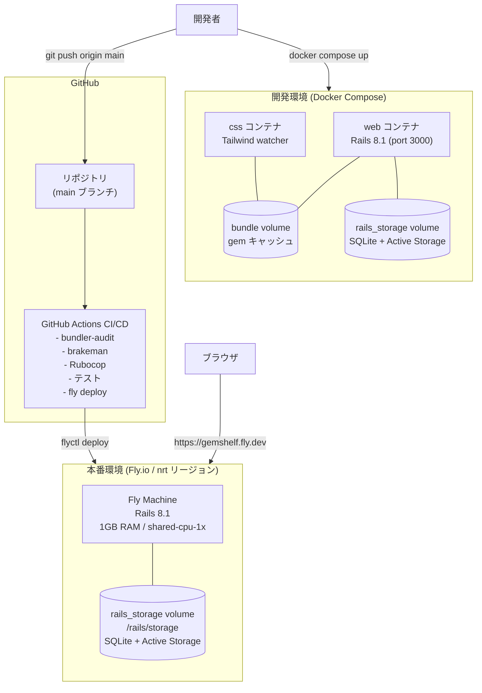

# システムアーキテクチャ図

```mermaid
graph TB
    subgraph Dev["開発環境 (Docker Compose)"]
        direction TB
        Web["web コンテナ\nRails 8.1 (port 3000)"]
        CSS["css コンテナ\nTailwind watcher"]
        BundleVol[("bundle volume\n gem キャッシュ")]
        StorageVol[("rails_storage volume\nSQLite + Active Storage")]
        Web --- BundleVol
        Web --- StorageVol
        CSS --- BundleVol
    end

    subgraph Prod["本番環境 (Fly.io / nrt リージョン)"]
        direction TB
        FlyMachine["Fly Machine\nRails 8.1\n1GB RAM / shared-cpu-1x"]
        FlyVol[("rails_storage volume\n/rails/storage\nSQLite + Active Storage")]
        FlyMachine --- FlyVol
    end

    subgraph GitHub["GitHub"]
        Repo["リポジトリ\n(main ブランチ)"]
        Actions["GitHub Actions CI/CD\n- bundler-audit\n- brakeman\n- Rubocop\n- テスト\n- fly deploy"]
        Repo --> Actions
    end

    Developer["開発者"] -->|docker compose up| Dev
    Developer -->|git push origin main| Repo
    Actions -->|flyctl deploy| Prod
    Browser["ブラウザ"] -->|https://gemshelf.fly.dev| Prod
```
